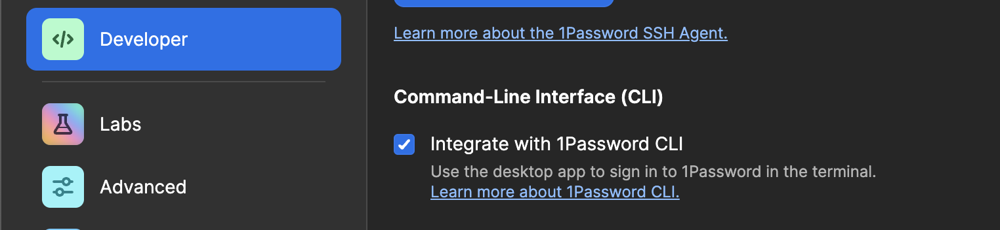
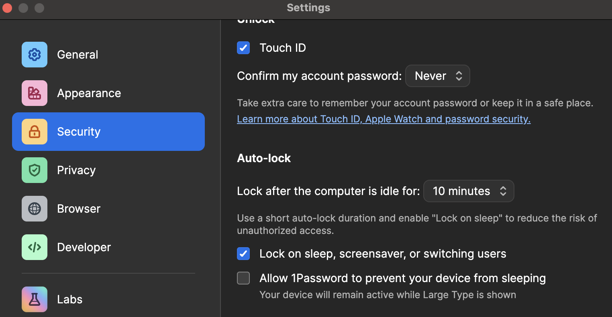

# envlock

Secure secret injection for any language — encrypted `.env` files + 1Password, zero secrets on disk.

## What is envlock?

**envlock** combines [dotenvx](https://dotenvx.com/) encrypted `.env` files with [1Password CLI](https://developer.1password.com/docs/cli/) to inject secrets into any process at runtime. Nothing is ever written to the filesystem in plaintext.

```bash
npx envlock dev        # injects secrets, then runs your dev command
npx envlock build      # same for build
npx envlock <anything> # works with any runtime
```

How it works:

```
1Password Vault
  └─ holds DOTENV_PRIVATE_KEY_*
       │
       ▼
envlock CLI
  ├─ op run  →  fetches key from 1Password
  └─ dotenvx run -f .env.<env>  →  decrypts in memory
       │
       ▼
  your process (node, python, go, rust, ...)
```

## This Repo

| Directory                        | What it is                                   |
| -------------------------------- | -------------------------------------------- |
| [`apps/website/`](apps/website/) | Static showcase site (Vite + React)          |
| [`examples/`](examples/)         | Fully runnable minimal examples per language |

## Showcase Site

```bash
cd apps/website
npm install
npm run dev
```

Open [http://localhost:5173](http://localhost:5173).

## Examples

Each example is a self-contained minimal app showing how to use envlock with a specific language or framework.

| Example                                  | Language / Framework |
| ---------------------------------------- | -------------------- |
| [`examples/node/`](examples/node/)       | Node.js (Express)    |
| [`examples/python/`](examples/python/)   | Python (Flask)       |
| [`examples/go/`](examples/go/)           | Go (net/http)        |
| [`examples/rust/`](examples/rust/)       | Rust (Axum)          |
| [`examples/ruby/`](examples/ruby/)       | Ruby (Sinatra)       |
| [`examples/java/`](examples/java/)       | Java (Spring Boot)   |
| [`examples/php/`](examples/php/)         | PHP                  |
| [`examples/dotnet/`](examples/dotnet/)   | .NET (ASP.NET Core)  |
| [`examples/hardhat/`](examples/hardhat/) | Hardhat (Ethereum)   |

Every example follows the same pattern — see any `examples/<lang>/README.md` for setup steps.

## Prerequisites

All examples require:

- **Node.js 18+** — for envlock-core (`npm install -g envlock-core`)
- **dotenvx** — for encrypting `.env` files (`npm install -g @dotenvx/dotenvx`)
- **1Password CLI** — for storing decryption keys

### Install 1Password CLI

```bash
brew install --cask 1password-cli@beta
op --version  # 2.33.0+
```

### Enable CLI integration in the 1Password app

1. Open **1Password** desktop app
2. Go to **Settings → Developer**
3. Enable **Integrate with 1Password CLI**



### Sign in

```bash
op signin
```

With biometric unlock enabled in the desktop app, the CLI authenticates automatically. You can adjust the auto-lock interval so you only need to unlock once per day.



## Quick Setup for Any Example

```bash
# 1. Install envlock globally
npm install -g envlock-core

# 2. Encrypt your .env file
npx dotenvx encrypt -f .env.development

# 3. Store the generated DOTENV_PRIVATE_KEY_DEVELOPMENT in 1Password
#    Set your onePasswordEnvId in envlock.config.js

# 4. Run
npx envlock dev
```

## Next.js Plugin

For Next.js, use the native `@envlock/next` plugin instead of the CLI wrapper:

```bash
npm install @envlock/next
```

```js
// next.config.js
import { withEnvlock } from "@envlock/next";

export default withEnvlock(
  {},
  {
    onePasswordEnvId: "your-env-id",
  },
);
```

## Benefits

- **No plaintext secrets on disk** — encrypted values are safe to commit
- **No `.env.keys` file** — decryption keys live in 1Password only
- **In-memory decryption** — secrets are never written to the filesystem
- **Works with any runtime** — Node, Python, Go, Rust, Ruby, Java, PHP, .NET, and more
- **CI-friendly** — set `DOTENV_PRIVATE_KEY_*` directly and envlock skips 1Password automatically
- **Works with any language**
